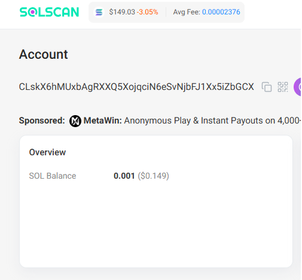
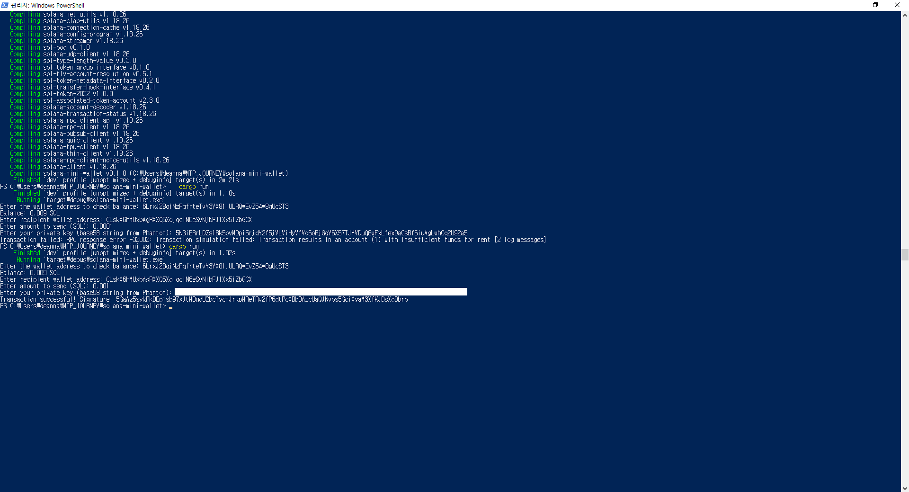

## solana-mini-wallet
A practical, minimalistic CLI wallet utility built with Rust for the Solana blockchain.
Instantly query the SOL balance of any wallet address on the Solana mainnet.
Send SOL from your own wallet to any recipient address.
Built with pure Rust and Solana RPC, without relying on high-level frameworks.
Demonstrates real-world blockchain integration and Rust CLI application design.

## Features
Query SOL balances for arbitrary wallet addresses
Transfer SOL to any recipient address
Simple and intuitive command-line interface
Easily extensible for additional Solana wallet features

## Example Screenshots
Below are screenshots of a successful transaction using this CLI tool.
Make sure that transaction.png and success.png are in the same directory as this README file.

## Transaction Input Example

## Usage
Clone the repository and install Rust.
Run cargo run in the project directory.

Follow the prompts:
Enter any Solana wallet address to view its SOL balance
Enter recipient wallet address
Enter amount to send (SOL)
Enter your private key (base58 string from Phantom or other Solana wallet)
View the transaction signature and check it on Solscan

This project showcases practical skills in Rust and blockchain development,
and serves as a solid foundation for more advanced Solana wallet applications.
